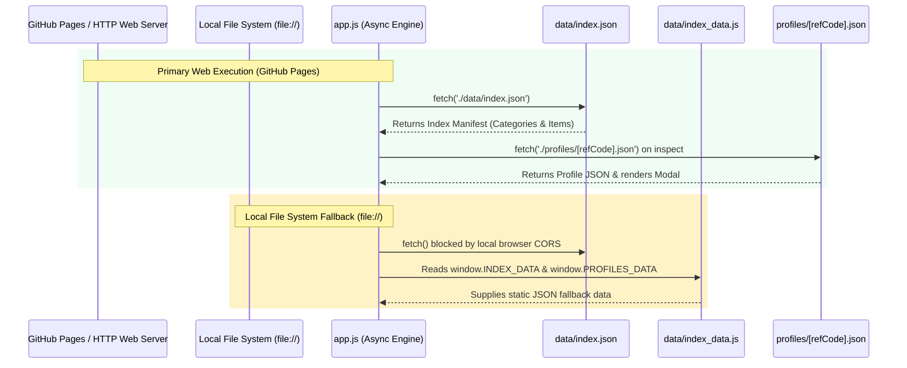
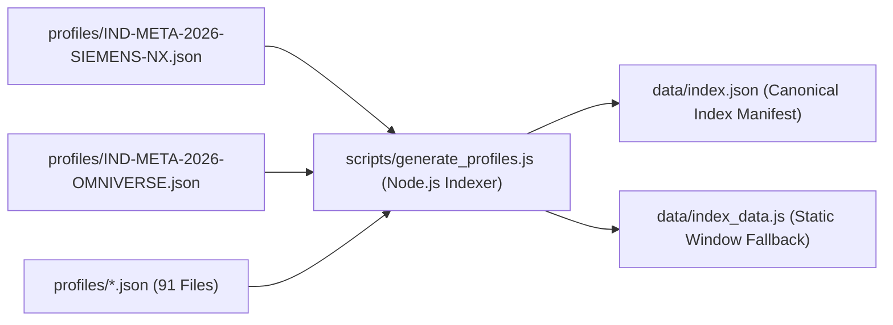

# Technical Architecture Specifications (`ARCHITECTURE.md`)

> **Industrial Metaverse Technology Taxonomy 2026 (`IMV-taxonomie`)**  
> Pure JSON Architecture, Zero-CORS Dual Loader, Data Pipeline, and 5-Layer Stack Specifications.

---

## 1. System Vision & Pure JSON Architecture

The architecture of **IMV-taxonomie** enforces a **Single Source of Truth** pattern. All technical metadata exists exclusively in canonical JSON files (`profiles/*.json`), removing code duplication between JavaScript data wrappers and HTML templates.

```
┌────────────────────────────────────────────────────────────────────────┐
│                          GLOBAL APP NAVBAR                             │
│     [ARENA2036 Logo] [IMV Logo]   IMV TAXONOMIE 2026   [Search Box]    │
├──────────────────────────────────────┬─────────────────────────────────┤
│    INDEX SIDEBAR (52px Header)       │   ITEMS VIEWPORT (52px Toolbar) │
│  Index (11 Kat.)        91 Elemente  │ Alle Technologien   91 Elemente │
├──────────────────────────────────────┼─────────────────────────────────┤
│  SCHICHT 1: Erfassung & OT (29)      │ ┌──────────────┐ ┌────────────┐ │
│  SCHICHT 2: Geometrie & CAD (23)     │ │ Siemens NX   │ │ Creo       │ │
│  SCHICHT 3: Middleware & AAS (8)     │ └──────────────┘ └────────────┘ │
│  SCHICHT 4: Simulation & VIBn (20)   │ ┌──────────────┐ ┌────────────┐ │
│  SCHICHT 5: Immersion & XR (11)      │ │ Omniverse    │ │ Vision Pro │ │
│  ... (Spacious Vertical Sidebar)     │ └──────────────┘ └────────────┘ │
└──────────────────────────────────────┴─────────────────────────────────┘
```

---

## 2. Dynamic JSON Engine & Dual Loading Protocol

To ensure seamless execution both on public web hosts (**GitHub Pages**) and local file systems (`file://`), `app.js` implements a **Dual Loading Engine**.



---

## 3. Data Indexer Pipeline (`scripts/generate_profiles.js`)

The indexer script acts as the single build pipeline for validation and index manifest compilation.



---

## 4. UI Layout & Container Header Unification

The layout architecture enforces isolated scroll containers with a unified header baseline:

```css
/* Unified Header Component (.container-header-bar) */
.sidebar-header, .items-control-bar {
  height: 52px;
  background: #FFFFFF;
  border-bottom: 1px solid var(--border-subtle);
  display: flex;
  align-items: center;
  justify-content: space-between;
  position: sticky;
  top: 0;
  z-index: 20;
}

/* Independent Scroll Containers */
.sidebar {
  width: 310px;
  height: 100%;
  overflow: hidden;
}

.category-tree {
  flex: 1;
  overflow-y: auto;
  padding: 16px;
}

.viewport-area {
  flex: 1;
  height: 100%;
  overflow-y: auto;
  padding: 0 24px 24px 24px;
}
```

---

## 5. Design System Tokens & Badges

```css
:root {
  --bg-canvas: #FFFFFF;
  --bg-subtle: #FAFAFA;
  --border-subtle: #E5E7EB;
  --text-heading: #111827;
  --text-body: #4B5563;
  --text-muted: #9CA3AF;
  --accent-orange: #FF5000;
  --accent-orange-subtle: #FFF7ED;
  --accent-orange-border: #FFD8A8;
}

/* Distinct Tier Badges */
.tier-1 { color: #047857; background: #ECFDF5; border-color: #A7F3D0; } /* Emerald Green */
.tier-2 { color: #1D4ED8; background: #EFF6FF; border-color: #BFDBFE; } /* Industrial Blue */
.tier-3 { color: #C2410C; background: #FFF7ED; border-color: #FFD8A8; } /* Safety Orange */
```

---

## 6. Security, Compliance & Data Privacy

* **Zero External Telemetry**: No third-party tracking scripts, analytics, or cookies.
* **100% GDPR Compliant**: No personal data collected or processed.
* **Open Source & Open Standards**: All JSON specifications adhere to OpenUSD and RAMI 4.0 data modeling recommendations.
