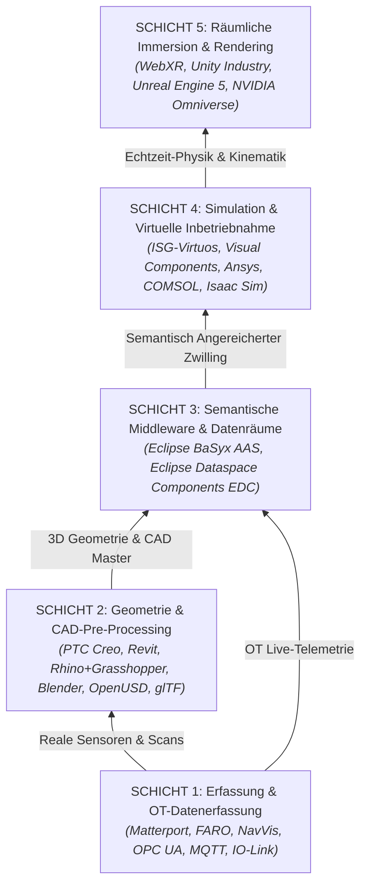

# Industrial Metaverse Technology Taxonomy

> **Offenes Forschungs-Audit & Interaktiver Taxonomie-Browser für den Industrial Metaverse Tech Stack**
> Ein Projekt des **ARENA2036 Forschungscampus**, gefördert durch das **Ministerium für Wirtschaft, Arbeit und Tourismus Baden-Württemberg**.

[](https://github.com/ARENA2036/industrial-metaverse-taxonomy/actions/workflows/deploy.yml)
[](LICENSE)
[](https://aousd.org/)
[](#)
[](#-ai-agent-assisted-development--agent-readability)

---

## 📌 Projekt-Übersicht & Philosophie

Das Projekt **industrial-metaverse-taxonomy** auditiert und strukturiert **91 Technologien, Protokolle und Standards** für den Aufbau digitaler Zwillinge und vernetzter Industrie-4.0-Fabriken im **Industrial Metaverse**.

Das System basiert auf dem **5-Schichten-Architekturmodell der ARENA2036**:
* **Schicht 1: Erfassung & OT-Datenerfassung** (LiDAR/SLAM, 360°, OPC UA, MQTT, IO-Link)
* **Schicht 2: Geometrie & CAD-Pre-Processing** (MCAD, BIM, DCC, OpenUSD, STEP, JT, glTF)
* **Schicht 3: Semantische Middleware & Datenräume** (Asset Administration Shell AAS, EDC, Cloud Twins)
* **Schicht 4: Simulation & Virtuelle Inbetriebnahme** (Ansys, COMSOL, ISG-virtuos, Isaac Sim)
* **Schicht 5: Räumliche Immersion & Rendering** (WebXR, Unreal Engine 5, Omniverse RTX, Vision Pro)

---

## 🏗️ 5-Schichten Architektur-Modell (ARENA2036 Standard)



---

## 💰 Kostengruppen-Klassifizierung (Cost Tiers)

| Kostengruppe | Bezeichnung | Investition | Zielgruppe & Fokus |
| :--- | :--- | :--- | :--- |
| <span class="tier-badge tier-1">Tier 1</span> | **KMU Starter & Open Source** | **≤ €30k / Kostenfrei** | Open-Source-Software, freie Standards & kostengünstige Module für schnelles Prototyping (z.B. Blender, OpenUSD, ROS 2, Eclipse BaSyx). |
| <span class="tier-badge tier-2">Tier 2</span> | **Industrieller Mittelstand** | **≤ €100k / Standort** | Kommerzielle Industrie-Software, spezialisierte CAD/CAE-Simulationsmodule & Hardware-Scanner (z.B. Unreal Engine Enterprise, Creo, Leica Scanners). |
| <span class="tier-badge tier-3">Tier 3</span> | **Enterprise OEM Plattformen** | **> €100k / OEM** | High-End OEM-Master-Systeme, PLM-Suites & werkweite Digital-Twin-Infrastrukturen (z.B. Siemens NX, NVIDIA Omniverse Enterprise, CATIA V6). |

---

## 📁 Bereinigte Repository-Struktur

```
industrial-metaverse-taxonomy/
├── index.html                  # Minimalist Greeter Landing Page (2-Panel Split Layout)
├── browser.html                # Interaktiver Taxonomie-Browser (Fixed Navbar & Dual Scroll Containers)
├── architecture.html           # Technische Architektur & 5-Schichten Spezifikation
├── impressum.html              # Impressum & Non-Commercial KMU Disclaimer
├── index.css                   # Minimalistisches Industrie-Designsystem (Vercel/Linear Aesthetic)
├── app.js                      # Dynamische Async JSON Engine & 5-Schichten Navigation
├── data/
│   ├── index.json              # Kanonischer Manifest-Index aller 91 Technologien (5 Schichten)
│   └── index_data.js           # Static Fallback Wrapper für file:// Ausführung
├── profiles/                   # Kanonische JSON Profil-Spezifikationen (Single Source of Truth)
│   ├── IND-META-2026-SIEMENS-NX.json
│   ├── IND-META-2026-NVIDIA-OMNIVERSE.json
│   └── ... (91 JSON-Dateien)
├── scripts/
│   └── generate_profiles.js    # Kanonischer JSON Indexer & Manifest Generator (5 Schichten)
├── assets/                     # 3 Aktive Marken-Logos (ARENA2036, Industrial Metaverse, Wirtschaftsministerium BW)
│   ├── ARENA2036_combinationmark_orange_black.png
│   ├── BaWue_WM_Absenderlogo_rgb_pos_Gefoerdert.svg
│   └── Metaverse Logo bunt.svg
├── .agents/
│   └── AGENTS.md               # AI Agent Guidelines & Repository Architecture Specifications
├── .gitignore                  # Git Ignore Konfiguration
├── .github/
│   └── workflows/
│       └── deploy.yml          # Automated GitHub Actions Pages Deployment
├── ARCHITECTURE.md             # Technische Architektur-Spezifikation (5 Schichten)
├── PRD.md                      # Product Requirements Document
└── _config.yml                 # Jekyll Konfiguration für GitHub Pages
```

---

## 🚀 Entwickler-Guide: Neue Technologien Hinzufügen

Dank der reinen JSON-Architektur ist das Erweitern der Taxonomie in 2 Schritten erledigt:

### 1. Neue JSON-Datei im Ordner `profiles/` anlegen
Erstellen Sie eine Datei `profiles/IND-META-2026-MEIN-TOOL.json`:
```json
{
  "refCode": "IND-META-2026-MEIN-TOOL",
  "categoryCode": "1.1",
  "categoryName": "Mechanisches CAD (MCAD)",
  "name": "Mein Industrie Tool",
  "subtitle": "Kurze Funktionsbeschreibung",
  "vendor": "Mein Unternehmen",
  "hq": "Deutschland (EU)",
  "businessModel": "Subscription",
  "url": "https://beispiel.de",
  "tier": "Tier 1",
  "costLabel": "≤ €30k",
  "status": "STANDARDIZIERT",
  "overview": "Ausführliche Beschreibung...",
  "features": [{ "title": "Kernfunktion", "desc": "Details..." }],
  "inputs": ["STEP", "OpenUSD"],
  "outputs": ["OpenUSD"],
  "bridges": ["NVIDIA Omniverse"],
  "evaluations": [{ "title": "Bewertung", "text": "Details..." }],
  "compliance": { "omniverse": "Native Extension", "sovereignty": "100% EU Souverän", "openStandard": "OpenUSD" },
  "deployment": { "effort": "Gering", "mode": "Cloud", "maturity": "Produktiv", "area": "Maschinenbau" },
  "staffing": "1x Spezialist"
}
```

### 2. Indexer-Skript ausführen
```bash
node scripts/generate_profiles.js
```
Das Skript validiert die JSON-Datei, aktualisiert `data/index.json` sowie den statischen Fallback `data/index_data.js`. Der Browser erkennt die neue Technologie automatisch!

---

## 🤖 AI Agent-Assisted Development & Agent-Readability

> [!NOTE]
> **Hinweis zur KI-gestützten Entwicklung:**  
> Teile der Software-Architektur, der Schema-Strukturierung, der Datenverarbeitungs-Skripte sowie der Dokumentation dieses Repositories wurden unter Zuhilfenahme autonomer KI-Entwicklungs-Agenten (Google DeepMind Antigravity / Gemini Agentic Workflow) umgesetzt.

### 🤖 100% Agent-Readable Repository Spezifikation
Dieses Repository ist explizit als **100% AI Agent-Readable** strukturiert:
* **Reine JSON-Daten-Pipeline**: Keine Datenbank-Abhängigkeiten; 100% kanonische JSON-Profil-Spezifikationen im Ordner `profiles/`.
* **Explizite Agenten-Richtlinien**: Vollständige Anweisungen, Schema-Standards und Build-Checklisten sind in [`.agents/AGENTS.md`](.agents/AGENTS.md) hinterlegt.
* **Deterministische Build-Skripte**: Automatisierte Index-Kompilierung (`node scripts/generate_profiles.js`), sodass KI-Agenten Technologien nahtlos hinzufügen, indizieren und validieren können.

---

## 🌐 Deploying to GitHub Pages

Jeder Commit auf den `main`-Branch löst den GitHub-Actions-Workflow `.github/workflows/deploy.yml` aus und schaltet die statische Seite live unter:
`https://ARENA2036.github.io/industrial-metaverse-taxonomy/`

---

## 📄 Lizenz & Förderung

Dieses Projekt steht unter der **MIT-Lizenz**.  
Gefördert durch das **Ministerium für Wirtschaft, Arbeit und Tourismus Baden-Württemberg** im Rahmen des **ARENA2036 Forschungscampus Stuttgart**.
